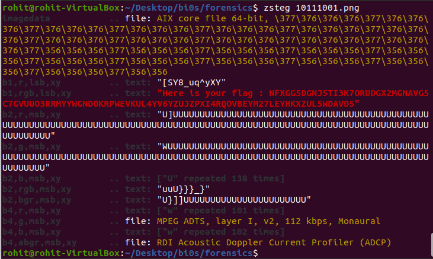

# 10111001

The most significant digit is not always left unnoticed...

## Solving

Here we are given an image steg.png


From the hint we can assume it is an MSB steganography. We use Zsteg on this image which gives



```
"Here is your flag : NFXGG5DGNJ5TI3K7ORUDGX2MGNAVG5C7GVUUO3RRMYYWGNDOKRPWEVKUL4YV6YZUJZPXI4RQOVBEYM27LEYHKXZUL5WDAVD5"
```

This is base32 encoded decoding it will give the flag

## Flag

**inctfj{4m_th3_L3ASt_5iGn1f1c4nT_bUT_1_c4N_tr0uBL3_Y0u_4_l0T}**