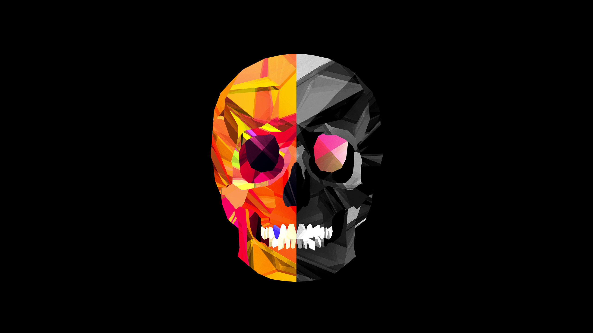
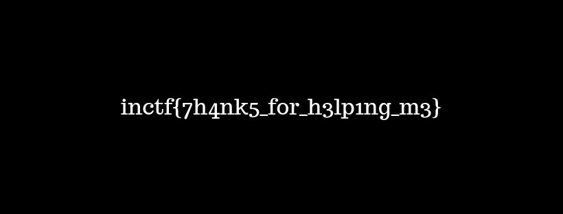
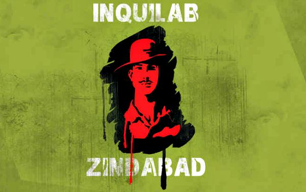
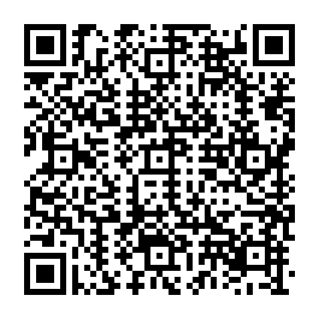
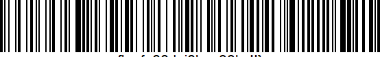

# Forensic Tasks set-2

### b_challenge4.docx

doing `strings b_challenge4.docx` gave the flag

Flag:- **flag{h0wz_the_joke_hahahha!!}**

### E_challenge4.jpg



`file E_challenge4.jpg` gave us the output 

```
E_challenge4.jpg: JPEG image data, comment: "Njk2ZTYzNzQ2NjdiNzkzMDc1NWY2NzMwNzQ1ZjM3NjgzMzVmNjY2YzM0Njc3ZA==", progressive, precision 8, 2560x1440, components 3
```

Here base64 decoding the comment gives us

```
696e6374667b7930755f6730745f3768335f666c34677d
```

hex decoding this gives us the flag

Flag:- **inctf{y0u_g0t_7h3_fl4g}**

### FS_challenge4.png

The image was not opening. Hex editor showed us the magic numbers were not correct. Correctigng it gave us the image



### s_challenge4.png


`exiftool s_challenge4.png` gave us the output

```
ExifTool Version Number         : 11.88
File Name                       : s_challenge4.png
Directory                       : .
File Size                       : 696 kB
File Modification Date/Time     : 2019:10:03 23:33:44+05:30
File Access Date/Time           : 2021:02:23 00:10:18+05:30
File Inode Change Date/Time     : 2021:02:05 19:55:12+05:30
File Permissions                : rw-rw-r--
File Type                       : PNG
File Type Extension             : png
MIME Type                       : image/png
Image Width                     : 825
Image Height                    : 550
Bit Depth                       : 8
Color Type                      : RGB
Compression                     : Deflate/Inflate
Filter                          : Adaptive
Interlace                       : Noninterlaced
Gamma                           : 2.2
White Point X                   : 0.3127
White Point Y                   : 0.329
Red X                           : 0.64
Red Y                           : 0.33
Green X                         : 0.3
Green Y                         : 0.6
Blue X                          : 0.15
Blue Y                          : 0.06
Background Color                : 255 255 255
Warning                         : [minor] Text chunk(s) found after PNG IDAT (may be ignored by some readers)
Datecreate                      : 2019-03-15T12:55:21+05:00
Datemodify                      : 2019-03-15T12:55:20+05:00
Comment                         : 5a6d78685a33746f4e474e724d334a7a587a52794d31387a646a4e796558646f4d33497a66513d3d
Image Size                      : 825x550
Megapixels                      : 0.454
```

hex decoding the comment gave us

```
ZmxhZ3toNGNrM3JzXzRyM18zdjNyeXdoM3IzfQ==
```

bas64 decoding the comment gave us the flag

Flag :- **flag{h4ck3rs_4r3_3v3rywh3r3}**

### SH_challenge4.jpg



Running `strings` on the image we got

**723fa61abce2c64e60f5f3a4c1426a15**

md5 decoding it with an online decoder gave us 

**WEAREFREE**

extracting using steghide using this passphrase we get a "vip.txt". The flag was in it

Flag :- **inctf{H4pPy_Ind3p3nD3nC3_D4Y}**

### SS_challenge4.png


The challenge is a qr code. Scanning it with `zbarimg` gave us

```
QR-Code:C_F(n1, n2) = 14 * [C(n1,n2) / 14] + 7 * FLAG(n1,n2) + (C(n1,n2) mod 7)
scanned 1 barcode symbols from 1 images in 0.01 seconds
```



but this is not the flag. getting the red0 of the same image in stegsolve gave us another qr code. Scanning it gave us the flag

Flag :- **VolgaCTF{5t3g0_m4tr3shk4_in_4cti0n}**

### Z_challenge4.png



it is bar code. Scanning it with `zbarimg` gave us the flag

Flag :- **flag{g00d_j0b_g33ks!!}**

## Bash Tasks

### Loops

Write shell scripts such that your scripts print the following paterns.

```
Write shell scripts such that your scripts print the following paterns.

Pattern 1: 
    #
   ##
  ###
 ####
#####

Pattern 2:
        #
       ###
      #####
     #######
    #########
   ###########
  #############
```

**1st Pattern**

```shell
read n
for i in $(seq 1 $n)
do
        for j in $(seq $i $n)
        do
                printf " "
        done
        for j in $(seq 1 $i)
        do
                printf "#"
        done
        printf "\n"
done
~        
```

**2nd Pattern**

```shell
read n
for i in $(seq 1 $n)
do
        l=` expr $i\*2-1`
        for j in $(seq $i $n)
        do
                printf " "
        done
        for ((j=1; j<=l; j++))
        do
                printf "#"
        done
        for j in $(seq $i $n)
        do
                printf " "
        done
        printf "\n"
done

```

### Reverse

Reverse and Find the flag.
Flag format is inctf{}

```
strings revers.me | rev | grep inctf
```

This gave us the flag

Flag :- **inctf{Y0u_ar3_g00d_4t_rev3rs1ng_1_gu3ss}**

### Stringer-Things

Obviously, this is not the flag, but I can give you the flag format.

inctf{s0m3_l33t_str1ng}

PS: "inctf" in the flag is also case insensitive. Find three flags in the file.

Doing

```
strings find-flags-in-me | grep -i inctf
```

gave us 2 flags

Flag-1 :- **inctf{y4yy!!!_found_th3_fir5t_fl4g}**
Flag-2 :- **InCtF{G00d_jobb!!This_is_the_2nd_on3}**

### Twins

Doing

```
diff Twin1 Twin2
```

just gave

```
Binary files Twin1 and Twin2 differ
```

Storing the strings of the Twin1 and Twin2 in another files 1 and 2 and doing

```
 diff 1 2 -y --suppress-common-lines
```

gave us

```
"D|							      |	"i|
(`							      |	n`
p							      |	c
"							      |	t
							      >	f
j-:							      |	{-:
oj\							      |	yj\
;							      |	0;
t							      |	ut
Bc5							      |	Bc5_
cl							      |	clGg
g							      <
{							      |	o
o7							      |	t_7
							      >	m
s0l6							      |	3s0l6
fY51'Z							      |	fY51'}
```

from here we get the flag

Flag :- **inctf{y0u_Got_m3}**