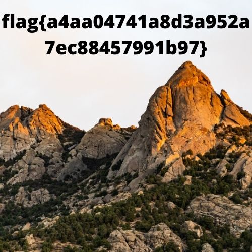

# Jay-chot

Raju sent me this file and told me that it's an important file for him, but he couldn't open it. Can you help me in retrieving this file?

Flag Format: **flag{some_l33t_string}**

## Solving

Here we get a jpg file which is not opening. So we looked at its hex code and the magic numbers were not in order

We corrected it and opened it

At first I thought it was an encoded string and we have to decode it. But it is the flag

## Flag

**flag{a4aa04741a8d3a952a7ec88457991b97}**

