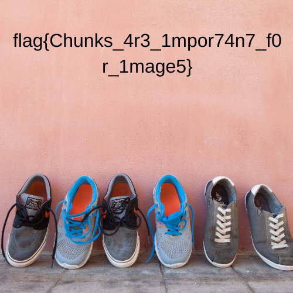

# Magic in digits

In one of the important folders of my backup drive, I found this file suspicious. I tried opening this file, but it's not opening. Can you help me in retrieving this file?

Flag Format: **flag{some_l33t_string}**

## Solving

Here we have a PNG file which is not opening so we try `pngcheck` , it gives :

```
magicindigits.png  this is neither a PNG or JNG image nor a MNG stream
ERROR: magicindigits.png
```

so we try `hexedit` and the magic numbers were wrong. so we corrected it and then again tried `pngcheck`

```shell
>>> pngcheck -vf magicindigits.png
File: magicindigits.png (445314 bytes)
  chunk IHDR at offset 0x0000c, length 13
    500 x 500 image, 32-bit RGB+alpha, non-interlaced
  chunk sRGb at offset 0x00025, length 1:  illegal (unless recently approved) unknown, public chunk
  chunk pHYs at offset 0x00032, length 9  chunk IDaT at offset 0x00047, length 8192:  illegal reserved-bit-set chunk
  chunk IDAT at offset 0x02053, length 8192
    zlib: compression header fails checksum
  chunk IDAT at offset 0x0405f, length 8192
  chunk IDAT at offset 0x0606b, length 8192
  chunk IDAT at offset 0x08077, length 8192
  chunk IDAT at offset 0x0a083, length 8192
  chunk IDAT at offset 0x0c08f, length 8192
  chunk IDAT at offset 0x0e09b, length 8192
  chunk IDAT at offset 0x100a7, length 8192
  chunk IDAT at offset 0x120b3, length 8192
  chunk IDAT at offset 0x140bf, length 8192
  chunk IDAT at offset 0x160cb, length 8192
  chunk IDAT at offset 0x180d7, length 8192
  chunk IDAT at offset 0x1a0e3, length 8192
  chunk IDAT at offset 0x1c0ef, length 8192
  chunk IDAT at offset 0x1e0fb, length 8192
  chunk IDAT at offset 0x20107, length 8192
  chunk IDAT at offset 0x22113, length 8192
  chunk IDAT at offset 0x2411f, length 8192
  chunk IDAT at offset 0x2612b, length 8192
  chunk IDAT at offset 0x28137, length 8192
  chunk IDAT at offset 0x2a143, length 8192
  chunk IDAT at offset 0x2c14f, length 8192
  chunk IDAT at offset 0x2e15b, length 8192
  chunk IDAT at offset 0x30167, length 8192
  chunk IDAT at offset 0x32173, length 8192
  chunk IDAT at offset 0x3417f, length 8192
  chunk IDAT at offset 0x3618b, length 8192
  chunk IDAT at offset 0x38197, length 8192
  chunk IDAT at offset 0x3a1a3, length 8192
  chunk IDAT at offset 0x3c1af, length 8192
  chunk IDAT at offset 0x3e1bb, length 8192
  chunk IDAT at offset 0x401c7, length 8192
  chunk IDAT at offset 0x421d3, length 8192
  chunk IDAT at offset 0x441df, length 8192
  chunk IDAT at offset 0x461eb, length 8192
  chunk IDAT at offset 0x481f7, length 8192
  chunk IDAT at offset 0x4a203, length 8192
  chunk IDAT at offset 0x4c20f, length 8192
  chunk IDAT at offset 0x4e21b, length 8192
  chunk IDAT at offset 0x50227, length 8192
  chunk IDAT at offset 0x52233, length 8192
  chunk IDAT at offset 0x5423f, length 8192
  chunk IDAT at offset 0x5624b, length 8192
  chunk IDAT at offset 0x58257, length 8192
  chunk IDAT at offset 0x5a263, length 8192
  chunk IDAT at offset 0x5c26f, length 8192
  chunk IDAT at offset 0x5e27b, length 8192
  chunk IDAT at offset 0x60287, length 8192
  chunk IDAT at offset 0x62293, length 8192
  chunk IDAT at offset 0x6429f, length 8192
  chunk IDAT at offset 0x662ab, length 8192
  chunk IDAT at offset 0x682b7, length 8192
  chunk IDAT at offset 0x6a2c3, length 8192
  chunk IDAT at offset 0x6c2cf, length 1075
  chunk iTXt at offset 0x6c70e, length 1120, keyword: XML:com.adobe.xmp
  chunk IEnD at offset 0x6cb7a, length 0:  illegal reserved-bit-set chunk
ERRORS DETECTED in magicindigits.png

```

So there were more errors and after solving all of that we could open the image 



## Flag

**flag{Chunks_4r3_1mpor74n7_f0r_1mage5}**