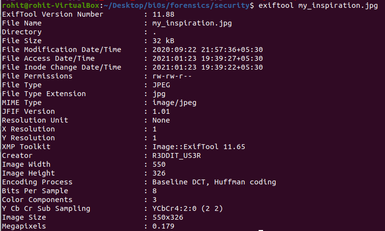
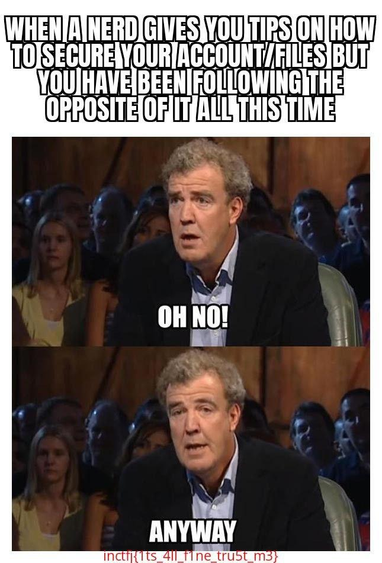

# Security 101

Nerd : Some people keep their username as password. Why would they do that ? Me : Hmm ...

## Solving

Here we get a zip file and when we unzip it there is another zip file and an image. inside the second zip file there is an image and that's where I think the flag is. It is password protected so we will search the password in the image we have got

When we run file on the image we got nothing. When we try exiftool it shows:

Here we can see the creator as R3DDIT_US3R and from the hint I think we can use this as the password.

When we unzip it using this password we get an image with the flag in it.

## Flag

**inctfj{1ts_4ll_f1ne_tru5t_m3}**