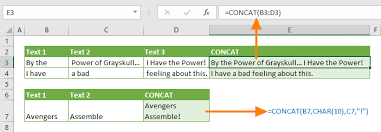
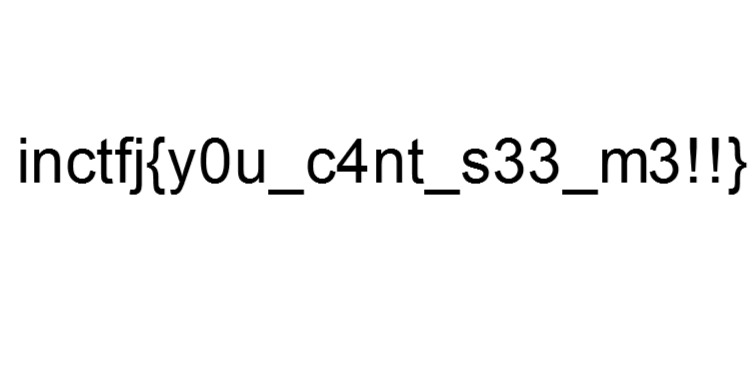
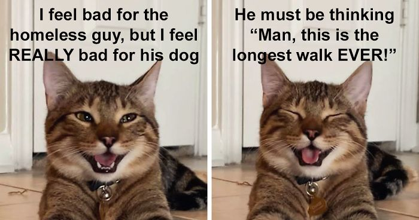

# con-the-cat

This image seems to big for a normal png! What do you think can be hidden in this?

## Solving

Gere we get an image sus.png. 



Doing `strings`  or `file`  don't give anything. The hint says it is too big to be normal. So I tried `binwalk`

which gave


So there are 4 images in it. I tried extract using `binwalk -e` but it didn't work So I used 

```shell
dd if=sus.png of=solved.jpeg skip=7821 bs=1
```

Which gave us the flag



There was also 3 other picture which I extracted using the same method

```shell
dd if=sus.png of=solved1.jpeg skip=22948 bs=1
dd if=sus.png of=solved2.jpeg skip=74478 bs=1
dd if=sus.png of=solved3.jpeg skip=89725 bs=1
```




## Flag

**inctfj{y0u_c4nt_s33_m3!!}**
